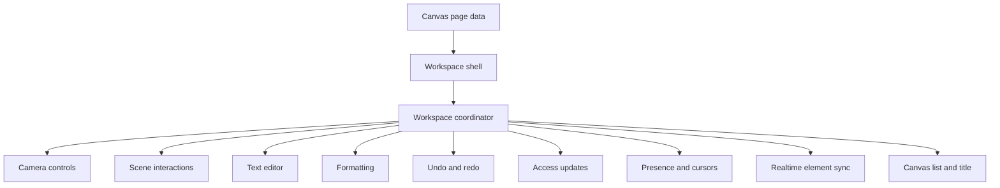
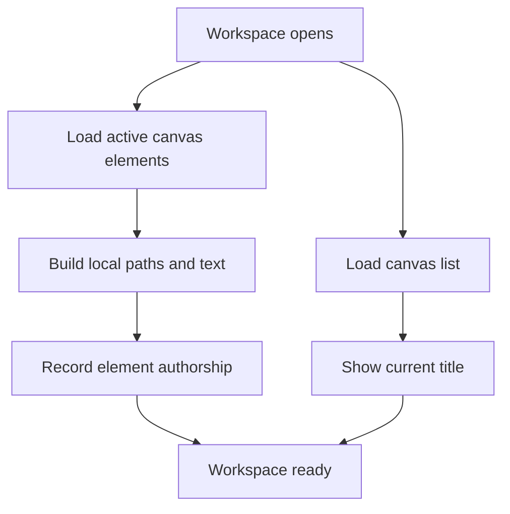
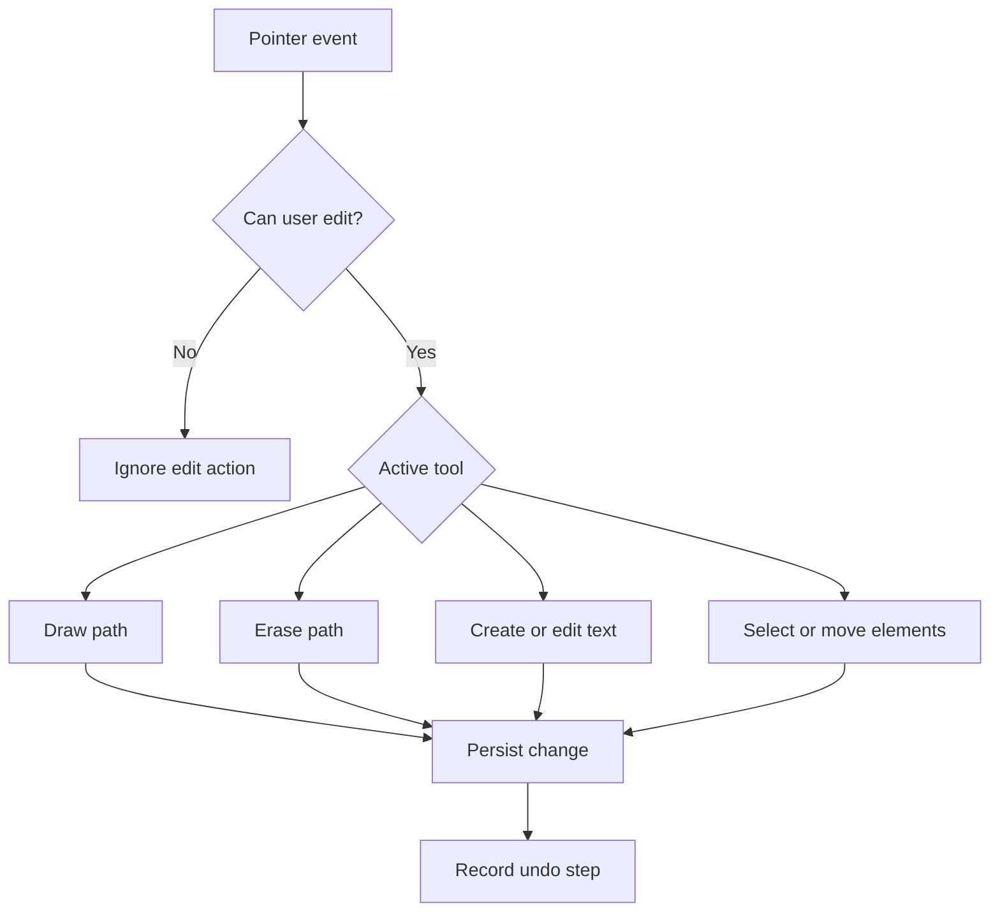
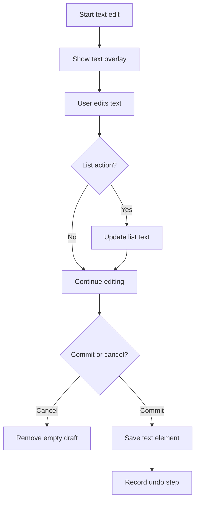
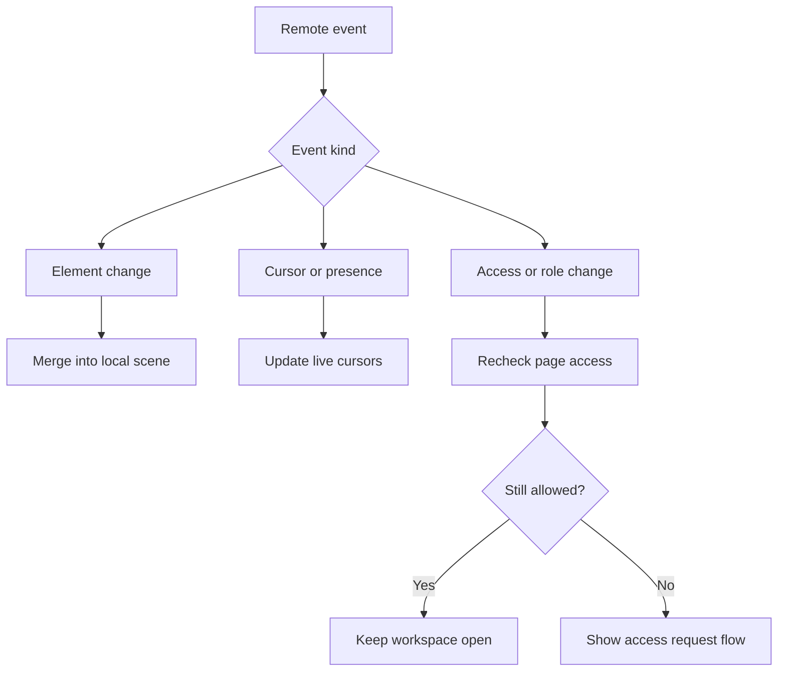
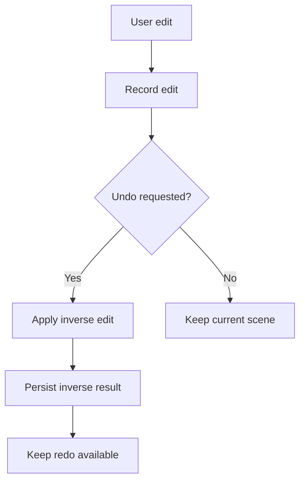

# Canvas Workspace Technical Overview

This document explains how the canvas workspace is coordinated after the
workspace refactor. It focuses on responsibilities and data flow, not internal
function names or state names.

## Purpose

The workspace is the interactive canvas surface. It combines drawing, text
editing, selection, movement, zooming, collaboration, access updates, and
server persistence into one user-facing experience.

The main design goal is to keep the Svelte component small and keep each
workspace concern isolated. The component renders the workspace and delegates
behavior to workspace stores. The stores are split by responsibility so a
change to text editing, camera movement, access handling, or realtime sync does
not require editing one large file.

## Coordination Model

The workspace has three layers:

1. The Svelte shell renders the toolbars, canvas scene, editor overlay, cursors,
   dialogs, and zoom controls.
2. The coordinator joins the smaller stores together and exposes one simple API
   back to the shell.
3. The smaller stores own focused behavior such as camera controls, scene
   interactions, text editing, presence, access notifications, and persistence
   sync.

## Responsibility Split

| Section | Responsibility |
| --- | --- |
| Workspace shell | Renders the visible workspace and passes user events into the coordinator. It should stay presentational. |
| Coordinator | Connects the smaller stores, owns the shared workspace context, and exposes the public surface used by the shell. |
| Canvas list and title | Loads available canvases, tracks the active canvas title, and handles title updates. |
| Camera controls | Owns pan, zoom, touch movement, view reset, cursor style, and persisted camera position. |
| Formatting | Owns text formatting, drawing style, highlighter behavior, and toolbar-facing formatting values. |
| Text editor | Owns text creation, editing, list behavior, keyboard handling inside the editor, blur commit behavior, and text persistence. |
| Scene interactions | Owns pointer behavior on the canvas scene, including drawing, erasing, selecting, dragging, moving, and double-click editing. |
| History | Owns undo and redo stacks and applies inverse changes through the shared scene mutation path. |
| Realtime element sync | Subscribes to canvas element changes and merges remote inserts, updates, and deletes into the local scene. |
| Presence | Owns live cursors and participant display data for the active canvas. |
| Access updates | Owns share dialog state, pending access requests, live request notifications, and live membership changes. |
| Keyboard | Owns global workspace shortcuts and routes them to history or scene actions. |
| Helpers | Provide reusable pure behavior such as color assignment, cursor style, camera math, and member display merging. |
| Types | Exposes shared canvas and workspace types from one central canvas type module. |

## Load Flow

The workspace loads the list of canvases and the active canvas contents
separately. This keeps title/list UI independent from scene hydration.

## User Interaction Flow

Scene events are routed through the coordinator into the scene interaction
section. That section decides what the current tool means for the pointer event
and then updates local scene data, history, and persistence as needed.

## Text Editing Flow

Text editing has its own section because it combines toolbar formatting,
temporary editor overlay behavior, list handling, commit behavior, history, and
persistence.

## Realtime Collaboration Flow

Realtime updates are split by concern. Element changes update the drawing scene.
Presence updates live cursors and participant display. Access updates decide
whether the user can remain in the workspace.

## Undo And Redo Flow

History is intentionally separate from the scene interaction rules. Scene
sections create meaningful edit records, while history applies those records
through the same mutation path used by normal editing.

## Access And Permission Boundaries

Client-side permission checks are for user experience. They prevent unavailable
actions from being offered and stop obvious invalid interactions before a
request is made. The server remains the authority for canvas access and element
ownership.

The workspace follows these boundaries:

- Readers can view, pan, zoom, see presence, and copy links where allowed.
- Editors can create elements and modify only elements they authored.
- Admins and owners can modify all elements and manage sharing.
- Failed server access checks cause the workspace to refresh its page data and
  fall back to the request-access flow when needed.

## Persistence Boundaries

The workspace uses optimistic local updates for a responsive editor. Local scene
data changes immediately, then the server write runs in the background. If a
write fails, the relevant section rolls back the local change when it has enough
context to do so.

Realtime events are treated as remote confirmation or remote edits. They merge
into the local scene unless the user is actively editing the same text element,
which avoids overwriting an in-progress local edit.

## Where To Add New Behavior

Use the smallest section that owns the behavior:

- Add new pointer or tool behavior in the scene interaction section.
- Add text-editing behavior in the text editor section.
- Add formatting controls in the formatting section.
- Add zoom, pan, or touch behavior in the camera section.
- Add collaboration indicators in the presence section.
- Add role, request, or membership behavior in the access section.
- Add pure reusable behavior in canvas helpers.
- Add shared public types in the canvas type module.

If a change needs several sections, keep the cross-section coordination in the
coordinator and keep the actual behavior in the focused section.
